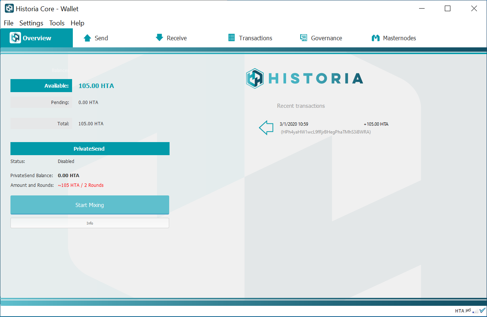
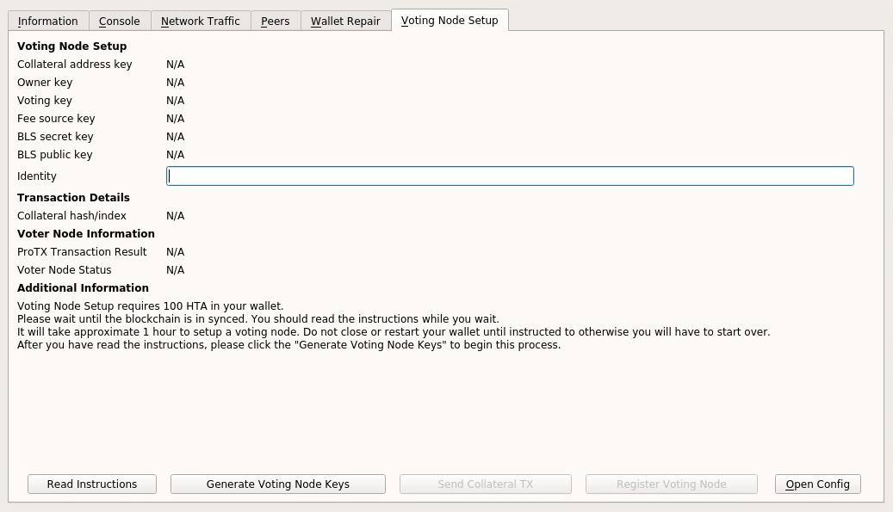
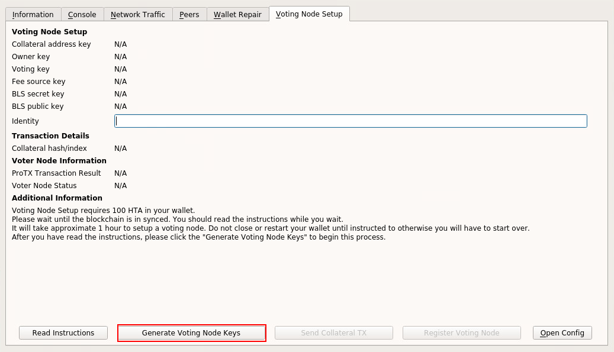
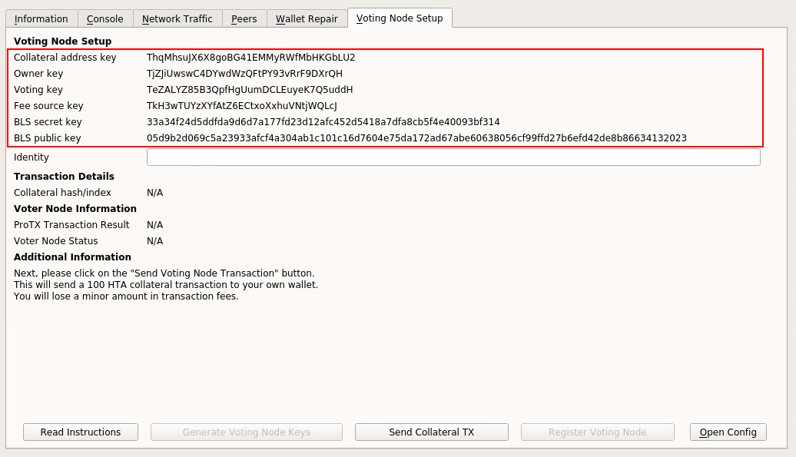
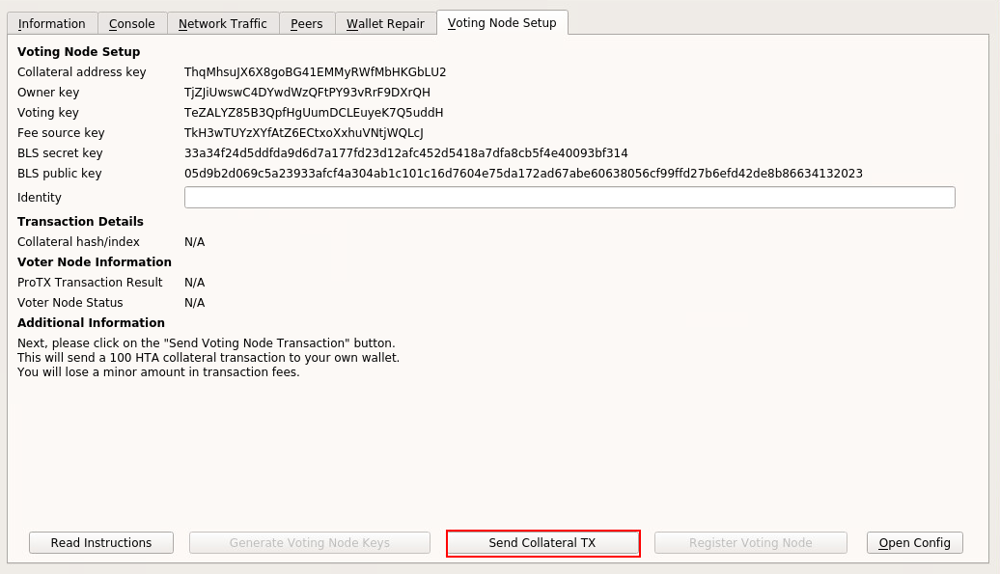
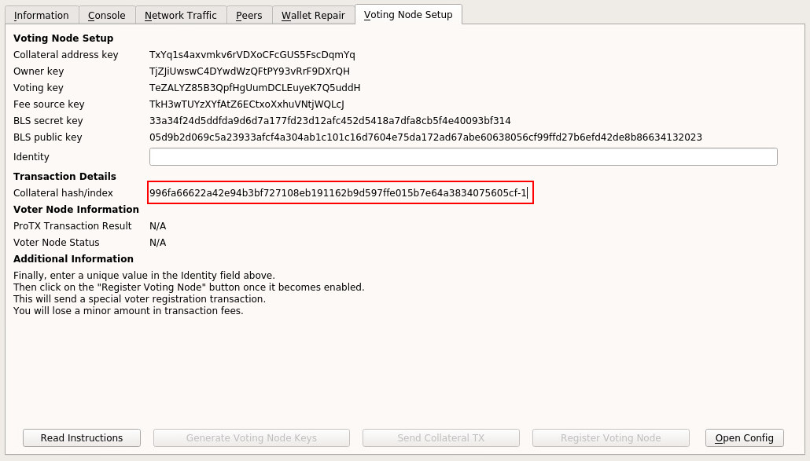
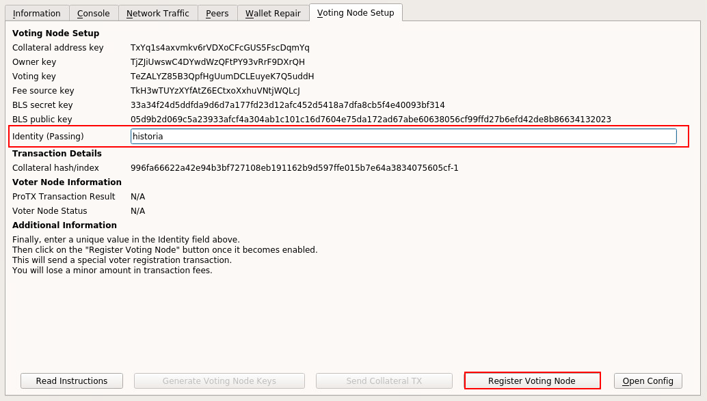
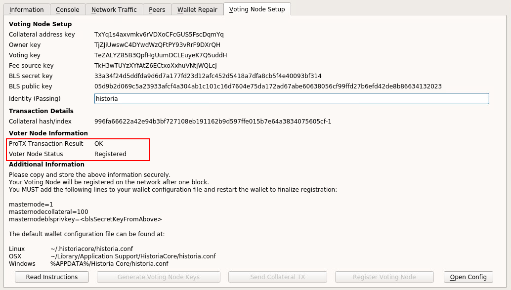
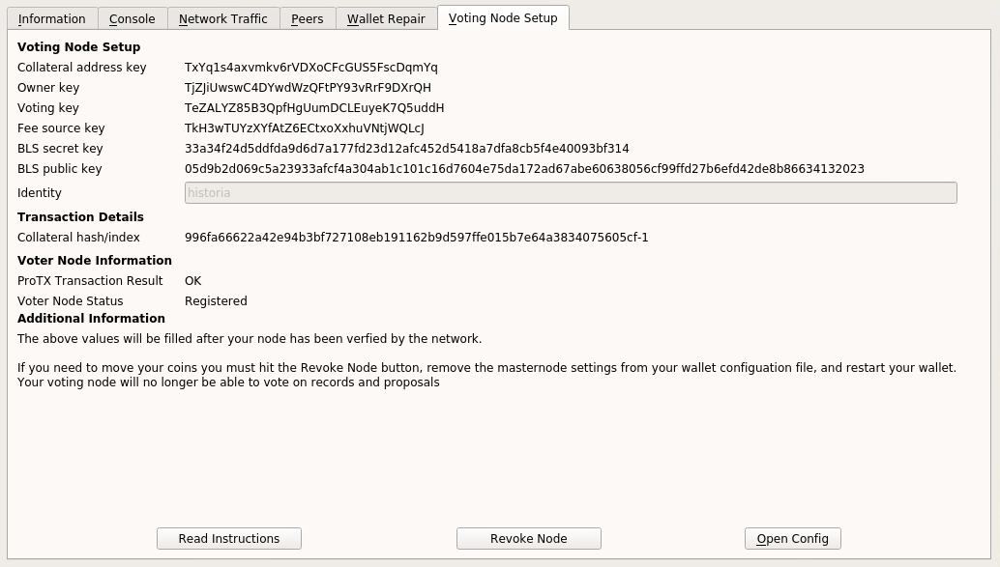

.. meta::
   :description: This guide describes how to set up a Historia voting node. 
   :keywords: historia, guide, voting nodes, setup,

.. _votingnode-setup:

==========================================
Setup a Voting Node - 100 Collateral
==========================================

*** Voting Nodes are NOT active yet, please wait for further notice before attempting to setup your voting node ***

Setting up a voting node requires a basic understanding of how to use a computer, as well as an ability to follow instructions closely. 

Before you begin
================

This guide assumes you are setting up a voting node for the first
time. You will need:

- 100 HTA.
- A little extra HTA for registration transactions: 1-5 HTA
- Historia Core Wallet v0.17.0.0 to store your Historia.
- A computer running Windows, MacOS, or Linux.

In this guide, we will assume you will be working from a Windows computer. However, alternative steps for using MacOS or Linux will be indicated where necessary.

Voting Node Requirements
------------------------

The Historia developers have tried to make this process as simple as possible for the users. The following requirements are required to setup a voting node.
 - Voting Node 
 
   - Collateral Requirement: 100 HTA
   - A little extra HTA for registration transactions: 1-5 HTA
   - Internet access on home network.
   - A computer running Windows, MacOS, or Linux.

In this guide, we will setup a Voting Node with collateral of 100. If you are looking to setup a Content Distribution Masternode with collateral of 5000 please see the appropriate guide for that.

Setup a Voting Node
=====================

Before you begin, please have the required HTA in your wallet. After you have the 
required HTA in your wallet you can begin to setup a Voting Node. This guide 
will describe the steps for Historia Core.

Option 1: Automated Voting Node Setup
-------------------------------------

Open Historia Core wallet and wait for it to synchronize with the network.
It should look like this when ready:

   Fully synchronized Historia Core wallet

Your wallet shold already it has more than 100 HTA in it.

Click **Tools > Setup Voting Node** to open the Setup Voting Node tab.
It should take about 1 hour to setup your Voting Node. Please do not 
close or switch this tabs until after you completed the process. 
Otherwise you may have to restart this process. It should look like 
this when ready:

   
   Voting Node Setup Tab in Historia Core wallet

Once you are ready to being click on the "Generate Voting Node Keys" 
button. This is generate all the required keys for you.

   
   Click Generate Voting Node Keys button
   
After your keys are generated, it is recommended to store these in 
notepad until the voting node has been registered and you have completed 
this process. Make special note of the BLS Secret Key. This is be require 
to finalize your Voting Node setup below.

   
   Click Generate Voting Node Keys button

Next click the Send Collateral TX button. This is automatically send the 
required collateral transaction to setup your Voting Node. This is send 
exactly 100 HTA to your own wallet. You will only lose a small amount in 
transaction fees.

   
   Click Send Collateral TX button
   
Once the collateral transaction has been processed you will have the 
collateral hash with index at the end of it. Copy this value to notepad.

   
   Collateral Hash 
   
Once the transaction is complete, view the transaction in a `blockchain 
explorer <http://blockexplorer.historia.network/>`_ by searching for the 
collateral transaction hash. For best results, please wait for 6 confirmations 
before the proceeding.

After 6 confirmations, please add a unique Identity that your Voting Node 
will be known by. It should be noted that this will also be your name on 
the future web application and currently you are not be allowed to change 
it. Changing your Identity might come in a future release but is currently 
not supported. It also must not be a duplicate name already in use. The wallet 
will automatically check for a valid name. You can use any of the following 
characters in your Identity::

-abcdefghijklmnopqrstuvwxyzABCDEFGHIJKLMNOPQRSTUVWXYZ0123456789

After you enter a valid name, the Register Voting Node button will become 
active.

   
   Valid Identity and the Register Button is now active
   
Click the Register Voting Node button to register your node. This is send a 
special transaction to register your node. You will only lose a small amount 
in transaction fees.

After you click the Register Voting Node button, and 1 block is mined your 
wallet will show a "Registered" status for your Voting Node.

   
   Registrated Status

To finalize your registration and to allow for in wallet voting you must create 
or edit your historia.conf file. You can click on the Open Config button to edit 
this file. Note this requires a association with a file type. Linux and MacOS 
should have this default. Windows will require you to open this file manually. 

Open notepad (or nano on Linux / MacOS) and open or create a new file named 
historia.conf Add the following lines into your historia.conf file::

  #----
  masternode=1
  masternodecollateral=100
  masternodeblsprivkey=<BLS Secret Key that you recorded from above>
  #----

If editing and saving on Windows, be sure to select All files if using Notepad 
so you don’t end up with a .conf.txt file extension by mistake. 

Save this file in the historiacore data folder on the PC running the Historia 
Core wallet using the filename historia.conf. You may need to enable View hidden 
items to view this folder. Be sure to select All files if using Notepad so you 
don’t end up with a .conf.txt file extension by mistake. For different operating 
systems, the Historiacore folder can be found in the following locations (copy and paste the shortcut text into the Save dialog to find it quickly):

+-----------+--------------------------------------------------------+--------------------------------------------+
| Platform  | Path                                                   | Shortcut                                   |
+===========+========================================================+============================================+
| Linux     | /home/yourusername/.historiacore                       | ~/.historiacore                            | 
+-----------+--------------------------------------------------------+--------------------------------------------+
| OSX       | /Macintosh HD/Library/Application Support/HistoriaCore | ~/Library/Application Support/HistoriaCore |
+-----------+--------------------------------------------------------+--------------------------------------------+
| Windows   | C:\Users\yourusername\AppData\Roaming\Historia Core    | %APPDATA%\Historia Core                    |
+-----------+--------------------------------------------------------+--------------------------------------------+

Close Historia Core and restart the Historia Core application and let it finish 
syncing. After your wallet has synced click **Tools > Setup Voting Node** to 
open the Setup Voting Node tab.

If everything has gone correctly, the result should look something like this:

   Your Voting Node is now setup correctly

There is no need to have your wallet open 24 hours a day. You can open and 
close your wallet when ever you like.

Encrypt And Backup Your Wallet
-------------------------------------

The first step is to secure your wallet (if you have not already done so). 
First, encrypt the wallet by selecting 
**Settings > Encrypt wallet**. You should use a strong, new password
that you have never used somewhere else. Take note of your password and
store it somewhere safe or you will be permanently locked out of your
wallet and lose access to your funds. Next, back up your wallet file by
selecting **File > Backup Wallet**. Save the file to a secure location
physically separate to your computer, since this will be the only way
you can access our funds if anything happens to your computer.

